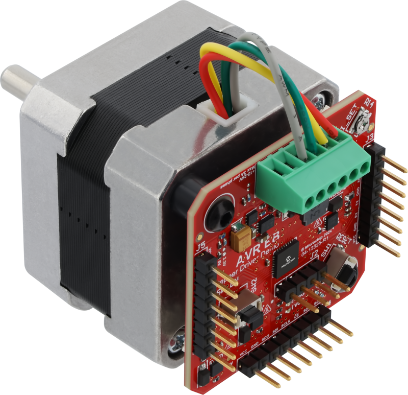

<!-- Please do not change this logo with link -->

<a target="_blank" href="https://www.microchip.com/" id="top-of-page">
   <picture>
      <source media="(prefers-color-scheme: light)" srcset="images/mchp_logo_light.png" width="350">
      <source media="(prefers-color-scheme: dark)" srcset="images/mchp_logo_dark.png" width="350">
      
   </picture>
</a>

# Stepper Motor Board Firmware

This repository contains an example to generate steps via function generator with the stepper driver reference design. This design is based on the [Multiphase Power Board](https://www.microchip.com/en-us/development-tool/EV35Z86A?utm_source=GitHub&utm_medium=TextLink&utm_campaign=MCU8_AVR-EB&utm_content=stepper-motor-reference-design-github-github&utm_bu=MCU08), the original code example is linked in related documentation. This [demo](https://github.com/microchip-pic-avr-examples/avr16eb32-bipolar-stepper-motor-drive/tree/main/3_Full-Ramp) was used to make both code sets.

## Full-Step Mode

In Full-Step mode, the motor rotates complete mechanical steps at once - for a standard 200 full-steps/revolution stepper motor, this would be 1.8 degrees for a sub-step. The motor's two coils are powered sequentially in four full-steps. The sequence determines the stepper motor's direction of rotation. Full-Step mode is simple to control, but can cause vibration and noise due to the larger step angle. Another drawback of using this mode is that the stepper motor's current consumption is maximized, with the lowest efficiency. This mode is often used in applications where the drive algorithm simplicity is more important than the smoothness of operation or precision.

## Half-Step Mode

In Half-Step mode, four intermediate steps are inserted between the four full-steps, which makes the stepper motor rotate by half of its full-step angle. This effectively doubles the number of mechanical steps per revolution - for a standard 200 full-steps/revolution stepper motor, this would be 0.9 degrees for a complete step, resulting in a smoother operation and less vibration compared to the Full-Step mode. This mode strikes a balance between simplicity, efficiency, smoothness and current consumption.

## MicroStep Mode

The Microstep mode divides the full-step angle into even smaller steps, providing even smoother operation and higher precision. The number of microsteps per full-step can vary, but common values are 8, 16, 32, or even 256 microsteps per full-step. Even though this mode requires the most complex control algorithms, the current consumption is lower than in Full-Step and Half-Step modes, with the highest precision, the least vibration and lowest noise. Microstepping is often used in applications where precision and smoothness of operation are paramount, such as in CNC machines.

## Related Documentation

- [AVR&reg; EB Product Page](https://www.microchip.com/en-us/products/microcontrollers-and-microprocessors/8-bit-mcus/avr-mcus/avr-eb?utm_source=GitHub&utm_medium=TextLink&utm_campaign=MCU8_AVR-EB&utm_content=stepper-motor-reference-design-github-github&utm_bu=MCU08)
- [AVR EB Code Examples on GitHub](https://github.com/microchip-pic-avr-examples?q=AVR16EB32)
- [AVR EB Stepper Example Code on GitHub](https://github.com/microchip-pic-avr-examples/avr16eb32-bipolar-stepper-motor-drive/tree/main)

## Software Used

- [MPLAB® X IDE v6.20 or newer](https://www.microchip.com/en-us/tools-resources/develop/mplab-x-ide)
- [AVR-Ex DFP-2.10.205 or newer Device Pack](https://packs.download.microchip.com/)
- [MPLAB XC8 compiler v3.00](https://www.microchip.com/en-us/tools-resources/develop/mplab-xc-compilers/xc8)
- [MPLAB Code Configurator (MCC) v 5.5.0](https://www.microchip.com/en-us/tools-resources/configure/mplab-code-configurator)

## Hardware Used

- [AVR EB Curiosity Nano](https://www.microchip.com/en-us/development-tool/EV73J36A?utm_source=GitHub&utm_medium=TextLink&utm_campaign=MCU8_AVR-EB&utm_content=stepper-motor-reference-design-github-github&utm_bu=MCU08)
- Stepper Driver Board
- Bipolar Stepper Motor (such as XY42STH34-035A). This PCB is designed to mount to the back of a NEMA 17 motor (42 mm x 42 mm)
- A Power Supply ( 12 - 24V nominal and 1 - 3A current capability, depending on the chosen motor)

## Functionaility

**The first application** mimics the interface of common stepper driver ASICs with `STEP` and `DIR` inputs. The `DIR` input controls the direction of rotation, while the `STEP` input is pulsed to advance the motor. There is also an onboard potentiometer for setting the current limit. The current limit is implemented using two Analog Comparators (AC) being OR'ed together in the Configurable Custom Logic (CCL) peripheral to generate a FAULT signal that shuts down the Waveform EXtension (WEX) for the remainder of the PWM cycle. The start of the next PWM waveform will clear the fault. 

**The second application** is a customized version of this [demo](https://github.com/microchip-pic-avr-examples/avr16eb32-bipolar-stepper-motor-drive/tree/main/3_Full-Ramp) to match the custom PCB.

## Motor Configuration

**Note:** For a standard 200 full-steps/revolution stepper motor, 1.8 mechanical degrees represent 360 electrical degrees (360 electrical degrees/200-steps is 1.8 mechanical degrees).

Before using a stepper motor, set the constants in the `stepper.h` file

There are a few motor specific options that need to be addressed when swapping motors

`R`: motor winding resistance expressed in [ohm]

`I_OUT`: Motor Peak Current expressed in [mA]

to change the stepping mode, uncomment the corresponding macro in `stepper.h`.  

  

Then, if using the potentiometer current limit, monitor the signals OUT1 and OUT2 on the pin header (1V/A) with an oscilloscope while adjusting to set the appropriate level.

## Setup
This project can be replicated in MCC, with the exception of the `stepper.h` and `stepper.c` files, these will have to be imported from this project.

### INTERRUPT  
  

- Global Interrupts Enable: Enabled

### CLKCTRL  
  

- Prescaler enabled: Disabled

### ADC
  
  

- Sample Duration : 255
- ADC Enable: Enabled
- Left Adjust: Enabled 
- Start command: Start a conversion immediately.
- Free Running: Enabled
- ADC Positive Channel Selection: ADC Input 20
- ADC Negative Channel Selection: Ground

### AC0
  

- Positive input MUX Selection: Positive Pin 4
- Negative input MUX Selection: Negative Pin 3

### AC1

- Positive input MUX Selection: Positive Pin 6
- Negative input MUX Selection: Negative Pin 3

### BOD

  
- BOD Operation in Active Mode: Enabled in continuous mode
- BOD Level: 2.7 V
- BOD Operation in Sleep Mode: Disabled

### CCL

  
  

- Enable CCL: Enabled

*For LUT0* -Connect the LUT as above, and edit the LUT configurations.

  

- Enable LUT: Enabled
- Clock Selection: OSCHF
- Gate Type: OR

### TCE

  

  

  

- Timer Enable: Enabled
- Waveform Generation Mode: SINGLESLOPE
- Scaling Mode: BOTTOM
- Amplitude Control Enable: Enabled
- Generate ISR: Enabled
- Overflow Interrupt Enable: Enabled

### WEX

 

  

  

- Global Override Settings for Waveform Outputs : All outputs enabled
- Deadtime inserion Channel 0-3: Enabled
- Requested Dead-time Low Side: 0.2us
- Requested Dead-time High Side: 0.2us
- Fault Input A Enable: Enabled
- Fault Event Input A Blanking Enable: Enabled

### EVSYS  

 

- (Generators):Channel 1 CCL_LUT0 -> 

- (Channels):Channel 1 -> 

- (Users):WEX A

### PIN MANAGER  

  

## Operation

There are a few notes to be made about the operation of the board. The original code was intended for multiple steps being taken, so doing 1 step causes some functions to be less than suitible for the application, such as `SPEED_LIMIT` and `STEPS_TO_SUBSTEP` These variables are given a default value, but can still be changed but comes with a significant performance decrease, this only goes for the function generator example.
  
## Results

 

This GIF shows the stepper motor hooked up to a function generator. The GIF also shows the LED and direction change made by the DIR pin being set.

This GIF shows the second example, which has the motor change its speed and direction via software. The speed and steps can be changed in software.

## Summary 

This has shown the benefits of using the AVR EB as a stepper motor controller. More information about this [reference design](https://www.microchip.com/en-us/tools-resources/reference-designs/smart-stepper-motor-driver) is available from microchip 
